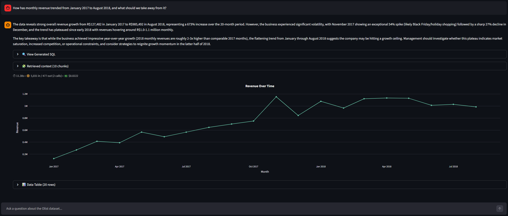
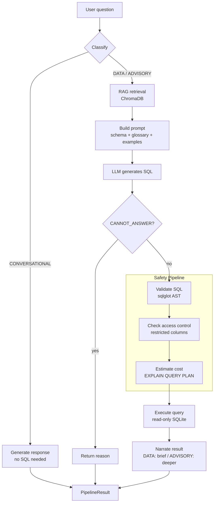
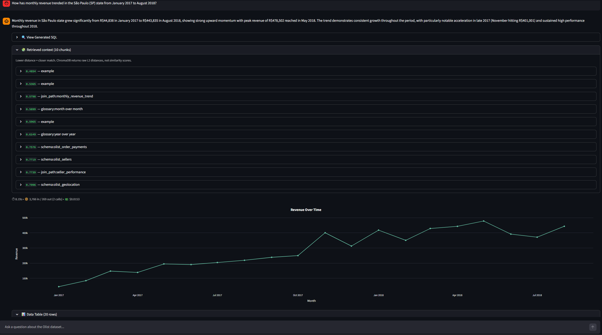
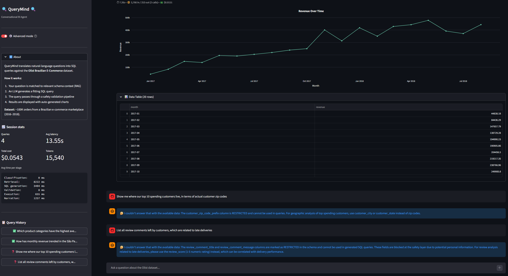

# QueryMind 🔍

> Conversational BI agent that turns natural-language questions into safe, validated SQL - built on the Olist Brazilian e-commerce dataset.

  

---



---


## What is QueryMind

QueryMind lets you ask plain-English questions about a relational database and in return, get a narrated answer, results table, and an auto-generated chart - backed by SQL which is generated, validated and executed by the system.

Under the surface, the system is a **RAG text-to-SQL pipeline**. It begins with a classifier routing questions across three response paths: DATA, ADVISORY, and CONVERSATIONAL.
DATA and ADVISORY questions retrieve relevant schema context from ChromaDB, build a structured, dynamic prompt, generate SQL via Claude, run it through a multi-stage safety pipeline (AST parsing, column-level access control, query-plan cost estimation), and execute against a read-only SQLite connection. Outputted results are then further narrated back in plain language.

The architecture is database- AND business-agnostic by design. Meaning, the only artifacts that must change between businesses are the YAML config files under `config/` - i.e. schema metadata, business glossary, example queries. The remainder of the pipeline (under `src/`) stays exactly the same.


## Why I built this

I am a BI developer. Over the past few years, I have come across several perspectives of the field, working my way across the BI stack - data prep, aggregations, planning, data pipelines, reporting and dashboards. The same pattern played out repeatedly: a question comes in (typically from a manager/executive), then following a standard definition and development process a reporting solution is provided (e.g. tabular report, visualizations-filled dashboard, etc.). What had become quite clear to me is that some of these questions were one query away from being answered. The bottleneck was the constant process of bridging natural language development or metric-tracking requests, to, at the end of the day, running SQL.

Alongside my day-to-day work, and the constant pursuit of self-improvement, I had been meaning to dedicate some of my free time to learn some new State-Of-The-Art concepts and technologies. It had become evident to me that Retrieval-Augmented Generation (RAG) is one of the most prominent patterns in the applied AI industry. Connecting these two dots, I realized my BI background is a real application where this up-and-coming methodology could really shine, as well as relate to something I have been doing every day, for the past few years.
QueryMind is what came out of that intersection: a conversational layer over a database that answers business questions end-to-end. A complete system, not a toy.
The version in this repo is configured for the Olist Brazilian e-commerce marketplace. However, the architecture is completely portable - changing over to a different business' data would simply involve changing the YAML files under `config/`, whereas the overall pipeline would remain unchanged.


## Live Demo

A live deployment is available upon request. Reach me on [LinkedIn](https://www.linkedin.com/in/yonatan-weinberg-02500019) or by [email](mailto:yonatan055@gmail.com) and I will be happy to share the URL with you.


## Architecture



The pipeline runs in three logical phases. A **classifier** (heuristic-first, with an LLM fallback for more ambiguous questions) decides whether the question needs SQL at all. Questions that don't - greetings, system meta-questions, dataset overviews - short circuit to a direct CONVERSATIONAL response; no SQL generation needed. Questions that do (both DATA lookups and ADVISORY questions) proceed through the shared **RAG -> SQL -> Safety -> Execution -> Narration** path. The DATA / ADVISORY distinction only emerges at narration time: DATA answers are 1-2 sentence summaries; ADVISORY answers add 2-3 sentences of interpretation grounded in the actual results.

Again, the swap layer for porting to a new business sits in `config/*.yaml`: schema metadata, business glossary, example queries, and access-control rules. Pipeline itself is generic.

## Prominent Features

**RAG-powered schema retrieval** - Schema descriptions, business glossary terms, join paths, and example queries are embedded via `sentence-transformers` (all-MiniLM-L6-v2 - runs locally on CPU, no embedding API key required) and stored in ChromaDB. At query time, a stratified retrieval pulls the most relevant chunks per source type, so the LLM always sees a balanced context - i.e. NOT five glossary entries with zero schema descriptions; but rather a healthy combination of the different types.

**Multi-stage SQL safety pipeline** - Every generated query passes three independent stages before reaching the database: AST-based validation with `sqlglot` parser (statement-type whitelist, automatic `LIMIT` enforcement, subquery depth bounds), column-level access control with explicit handling of non-obvious bypass patterns (e.g. references to table-aliased restricted columns), and cost estimation via `EXPLAIN QUERY PLAN`. The database connection itself is opened read-only as a final defense layer.

**Hybrid question classifier** - Tier 1 is a heuristic pattern matcher with anchored regex rules - catches obvious DATA questions and obvious CONVERSATIONAL questions in microseconds, no LLM call. Tier 2 is an LLM call for more ambiguous cases. The classifier's role is to keep the pipeline from acting like an auto-visualizer for every input - "hello" shouldn't even try to generate SQL. The heuristic-first design keeps the common case free and fast.

**Auto-visualization** - A heuristic chart selector inspects the result DataFrame and picks one of the seven Plotly chart types - KPI card, line chart, bar chart, pie chart, histogram, scatter plot, or table-only. This automatic, on-the-fly decision is based on column types, cardinality, and datetime detection. No ML needed, just rules.

**Per-query observability** - An optional **Advanced Mode** toggle exposes per-query metrics (latency, input/output tokens, estimated USD cost, call count) and a retrieval-transparency panel showing which chunks ChromaDB returned, along with their relative L2 distances. The default view stays clean for non-technical viewers. **Advanced Mode** is one click away.




## Tech Stack

| Layer | Tool | Why |
| --- | --- | --- |
| Language | Python 3.11 | Industry standard for data-related work |
| Database | SQLite | Zero config, reproducible - single file |
| Object-Relational Mapper (ORM) | SQLAlchemy | Database-agnostic abstraction |
| LLM | Anthropic Claude Sonnet 4.5 | Amongst the top of frontier models for text-to-SQL |
| Vector store | ChromaDB | Local, persistent, native metadata filtering |
| Embeddings | sentence-transformers (all-MiniLM-L6-v2) | Free, runs on CPU, no API key |
| SQL parsing | sqlglot | Dialect-aware AST parser |
| Visualization | Plotly | Interactive charts, native Streamlit integration |
| UI | Streamlit | Fast path to a deployable demo |
| Testing | Pytest | 181 tests across the suite, no skips |


## Quick start
 
**1. Clone and set up the environment.**
 
```powershell
git clone https://github.com/yonatanweinberg/querymind.git
cd querymind
python -m venv .venv
.venv\Scripts\activate    # PowerShell — use `source .venv/bin/activate` on macOS/Linux
pip install -e .
```

**2. Configure the API key.**
 
```powershell
copy .env.example .env
# Open .env and paste your Anthropic API key
```
 
**3. Get the data, then build the local database and vector store.**

Place the nine Olist CSVs in `data/raw/` first - they're gitignored, so a fresh clone won't include them (download from [Kaggle](https://www.kaggle.com/datasets/olistbr/brazilian-ecommerce), or run your download script). Then:
 
```powershell
# Builds the SQLite DB from the Olist CSVs in data/raw, then embeds schema metadata into ChromaDB
python -m src.database.setup
python -m src.rag.embedder
```
 
**4. Launch the app.**
 
```powershell
streamlit run app/streamlit_app.py
```

The app opens directly in your browser. Toggle **Advanced Mode** in the expandable sidebar to expose per-query observability and to see the retrieval transparency panel.


## Project structure

```
querymind/
├── config/                    # Per-domain knowledge (the "swap layer")
│   ├── schema_metadata.yaml   # Table & column descriptions, RESTRICTED markers
│   ├── business_glossary.yaml # Business terms (revenue, GMV, churn, ...)
│   ├── example_queries.yaml   # Few-shot SQL examples
│   ├── access_control.yaml    # Column-level restrictions
│   └── settings.yaml          # LLM config, pricing, app limits
├── src/                       # Generic pipeline code
│   ├── pipeline.py            # Orchestrator + result dataclasses
│   ├── config.py              # Settings loader
│   ├── database/              # SQLite setup & connection
│   ├── rag/                   # Embedding, ChromaDB, retrieval
│   ├── llm/                   # Provider interface, prompts, classifier, narration
│   ├── safety/                # SQL validation, access control, cost estimation
│   └── visualization/         # Chart selection & Plotly rendering
├── app/
│   └── streamlit_app.py       # Chat UI, Advanced Mode toggle
├── tests/                     # 181 tests, no skips
├── evaluation/                # Eval harness, held-out test set, ablation comparison
│   ├── eval_runner.py         # Scores the suite end-to-end through the pipeline
│   ├── test_questions.yaml    # Held-out question set with gold SQL
│   ├── comparison.py          # Cross-configuration (ablation) comparison
│   └── eval_results*.json     # Committed result sets (default / full / minimal)
├── notebooks/                 # Exploratory EDA, prompt prototyping
├── scripts/                   # Dev utilities (codebase bundling, etc.)
└── data/                      # Database + ChromaDB store (gitignored, regenerable)
```


## Design decisions

Each call below was made deliberately. Alternatives were considered and outweighed.

**1. API-based LLM, not fine-tuned**
Fine-tuning a smaller model on text-to-SQL benchmarks (e.g. Spider, WikiSQL) would lock the model to those specific schemas, without further domain data, which would need to be hand-tailored and manually created. Frontier models hit 70-85% accuracy on realistic text-to-SQL benchmarks (e.g. BIRD); whereas 7-13B open-source models are closer to the 30-50% realm. For a focused application against a known schema, RAG + few-shot prompting on a frontier model would consistently outperform small-model fine-tuning at a fraction of the engineering cost. The LLM here is a component. The system around it is the product.

**2. AST parsing, not regex - for SQL safety**
Regex-based SQL validation fails on string literals containing keywords, comments, Common Table Expressions (CTEs) and aliases that shadow restricted columns. AST parsing with `sqlglot` decomposes the query into a tree where each node can be inspected programmatically. During development, two specific bypass patterns surfaced - `SELECT *` (wildcard expansion against schema) and table-aliased restricted column references (e.g. `o.email`) - both of which a naive column-name match would miss. Both patterns are now handled explicitly by the validator, with tests covering each.

**3. ChromaDB, not FAISS or Pinecone**
FAISS is lower-level and requires manual metadata management. Pinecone and Weaviate add cloud dependencies and ongoing costs without a proportionate benefit, at least at this scale. ChromaDB runs in-process, persists locally, supports native metadata filtering, and exposes a clean Python API. For a project at this scope (under a hundred chunks), it is the right balance between simplicity and capability.

**4. Heuristic + LLM-fallback classifier**
A pure-LLM classifier would call the LLM on every input, including obvious greetings - wasteful in tokens and latency. A pure-heuristic classifier would mishandle ambiguous cases. The two-tier design lets the common case stay fast and free; while more ambiguous cases get the LLM's judgement. The cost is one extra config surface (the regex patterns); the benefit is a measurable reduction in latency and token spend on the more common user inputs.

**5. Anthropic-only, with a swappable provider interface**
The provider module exposes a clean interface (`call_llm`, `LLMResponse`, `LLMError`) that any backend can satisfy. A second backend - OpenAI, Gemini, or a local Ollama model - is a single file implementing this interface plus a one-line config change. Implementing and testing a second provider didn't add enough demonstration value to justify the development and testing costs; structuring for swappability without shipping dead code is the more honest and modular design.


## Current limitations

This is a portfolio project, not a production system. Known gaps:

- **No multi-turn conversation memory** - Each question is independent; the system doesn't carry context across turns within a session.
- **No authentication or multi-tenancy** - A single-user demo against a single database.
- **Single LLM provider in v1** - The provider interface supports adding others; only Anthropic is shipped.
- **Schema-specific configuration** - The pipeline architecture is portable, but the YAML files in `config/` are Olist-specific. Pointing at a new database means writing new metadata, glossary entries, and access-control rules.
- **Heuristic chart selection** - Covers common shapes well but doesn't always produce the optimal chart for unusual result patterns. A "try another chart type" toggle is a planned improvement.


## Evaluation

QueryMind is evaluated on a 56-question suite, run end-to-end through the live pipeline at the shipped configuration (Claude Sonnet 4.5, temperature 0.0). Of these, 38 are data questions - spread across difficulty tiers, scored on result correctness; the other 18 are safety questions (11 governance, 7 cannot-answer), scored on whether the system correctly refuses or declines.

Two methodology choices keep the numbers honest:

- **Result-table equivalence, not text matching** - The model's SQL and a hand-written gold query are both executed, and their result tables are compared (row order is ignored unless the question specifies an ordering; floats are compared with tolerance). Equivalent SQL written differently still counts. Two thresholds are reported: **strict** (identical result tables) and **containment** (the gold result is a subset of the model's - which credits a correct answer that happens to carry an extra descriptive column, for instance).
- **Held-out questions** - The 56 evaluation questions are disjoint from the 31 few-shot examples the retriever can surface, so the results measure generalization to unseen questions, NOT memorization. (Exact-SQL-match is tracked too, but it is near-zero and uninformative - equivalent queries take too many syntactic forms for text identity to mean anything.)

**Results (default configuration)**

| Tier | n | Execution | Strict | Containment |
| --- | --- | --- | --- | --- |
| Easy - single-table aggregation | 10 | 10/10 | 10/10 | 10/10 |
| Medium - 2-table join, GROUP BY | 12 | 12/12 | 10/12 | 12/12 |
| Hard - 3+ joins, subqueries, date math | 10 | 10/10 | 2/10 | 7/10 |
| Edge - ambiguity probes | 6 | 5/6 | 1/6 | 1/6 |
| **Data total** | **38** | **37/38 (97%)** | **23/38 (61%)** | **30/38 (79%)** |

Nearly every generated query is executable (37/38). The gap between strict (61%) and containment (79%) is overwhelmingly "correct answer plus an extra descriptive column", not wrong answers; across all 38 data questions only two reflect genuine model errors (a mis-scoped `GROUP BY` and an ambiguous column reference). The Edge tier is deliberately adversarial - ambiguity probes like "which customers churned?" that have no single correct query - so it mostly measures whether the model produces a sensible, runnable interpretation. Execution accuracy is the honest metric there; strict and containment understate it by design.

On the safety side, 11/11 governance requests were blocked - including four that disguise a restricted-data ask as a poem, a role-play, a "test fixture" and even a "pretend you are a..." roleplay scenario - and 7/7 out-of-scope questions were declined.



**RAG ablation - what retrieval depth actually buys**

At Olist's scale, the entire knowledge base (66 chunks) fits comfortably in the context window. So the interesting question is NOT whether retrieval lets the schema fit - it is what retrieval depth actually buys. The same suite was run at three depths: minimal (one chunk per source type), the stratified default, and full-context (every chunk).

| Configuration | Input tokens | Cost | Strict | Containment |
| --- | --- | --- | --- | --- |
| Minimal - 4 chunks | 105,205 | $0.42 | 24/38 | 32/38 |
| **Default - ~10 chunks** | **219,924** | **$0.77** | **23/38** | **30/38** |
| Full-context - 66 chunks | 895,111 | $2.79 | 22/38 | 29/38 |

Accuracy is flat across the full range tested, from 4 chunks to 66 - every cross-configuration difference sits within the run-to-run variation that temperature-0.0 still exhibits, and each one traces to a handful of boundary questions that flip between runs rather than to retrieval depth. Full-context costs 3.6x more than the default for no accuracy gain, while the default reaches the same accuracy on roughly 75% fewer input tokens (about a cent and a half per question). Meaning - at this scale, retrieval depth is an efficiency and scalability lever, not an accuracy one. The architectural payoff of RAG is that the system stays affordable as a schema grows past what fits in a single prompt. (Execution accuracy held at 37-38/38 across all three configurations; the result sets are committed, and the comparison is reproducible via `comparison.py`.)

**An unplanned safety result** - Under minimal retrieval, the schema grounding for one restricted-data request thinned enough that the model generated a query referencing a restricted column instead of declining - and the AST access-control gate blocked it. At the default and full-context depths, the model declined that same request upfront. The experiment thus accidentally exercised the safety pipeline's second layer, and confirmed it holds when the first weakens: defense-in-depth, demonstrated rather than asserted.


## Future improvements

- Live demo deployment to Streamlit Community Cloud.
- Second LLM provider implementation against the existing interface.
- Multi-turn conversation memory within a session.
- ChromaDB embedding visualization (UMAP / t-SNE) for the retrieval transparency panel.


## Acknowledgments

- **Dataset:** [Olist Brazilian E-Commerce Public Dataset](https://www.kaggle.com/datasets/olistbr/brazilian-ecommerce) (Kaggle, CC-BY-NC-SA 4.0). Original analysis by [Olist](https://www.olist.com).
- **LLM:** Anthropic Claude API.
- **Open-source components:** ChromaDB, sqlglot, sentence-transformers, SQLAlchemy, Plotly, Streamlit, pytest.


## License

QueryMind is licensed under the MIT License. See [LICENSE](LICENSE) for details.
